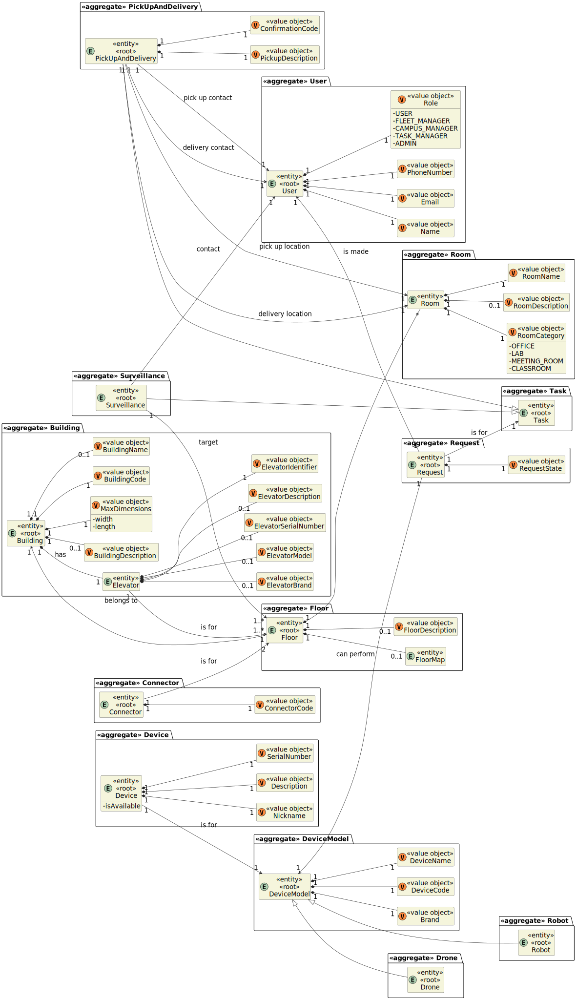

# LAPR5 Wiki - Group 52

## Domain Model

## Client Clarifications

You can check the client clarifications throughout the project in the following link: [Client Clarifications](./client_clarifications/readme.md)

## Use Case Diagram

The use cases of each sprint are described in [this section](./ucd/readme.md).

## Group Members

| Student Nr. | Name            | No. |
| ----------- | --------------- | --- |
| 1211299     | André Barros    | 5   |
| 1211277     | Carlos Lopes    | 1   |
| 1211285     | Ricardo Moreira | 3   |
| 1211289     | Tomás Lopes     | 4   |
| 1211288     | Tomás Russo     | 2   |

## Requirements

### Sprint A

| ID                                      | Assigned To               |
| --------------------------------------- | ------------------------- |
| [01 [150]](sprint-a/us01-150/readme.md) | 1211277, 1211289, 1211299 |
| [02 [160]](sprint-a/us02-160/readme.md) | 1211277                   |
| [03 [170]](sprint-a/us03-170/readme.md) | 1211277                   |
| [04 [180]](sprint-a/us04-180/readme.md) | 1211288                   |
| [05 [190]](sprint-a/us05-190/readme.md) | 1211277, 1211288, 1211299 |
| [06 [200]](sprint-a/us06-200/readme.md) | 1211288                   |
| [07 [210]](sprint-a/us07-210/readme.md) | 1211288                   |
| [08 [220]](sprint-a/us08-220/readme.md) | 1211285                   |
| [09 [230]](sprint-a/us09-230/readme.md) | 1211277                   |
| [10 [240]](sprint-a/us10-240/readme.md) | 1211277, 1211285, 1211288 |
| [11 [250]](sprint-a/us11-250/readme.md) | 1211285                   |
| [12 [260]](sprint-a/us12-260/readme.md) | 1211285, 1211289          |
| [13 [270]](sprint-a/us13-270/readme.md) | 1211285, 1211288, 1211289 |
| [14 [280]](sprint-a/us14-280/readme.md) | 1211289                   |
| [15 [290]](sprint-a/us15-290/readme.md) | 1211289                   |
| [16 [300]](sprint-a/us16-300/readme.md) | 1211299                   |
| [17 [310]](sprint-a/us17-310/readme.md) | 1211285, 1211289, 1211299 |
| [18 [350]](sprint-a/us18-350/readme.md) | 1211277, 1211288, 1211289 |
| [19 [360]](sprint-a/us19-360/readme.md) | 1211285, 1211288          |
| [20 [370]](sprint-a/us20-370/readme.md) | 1211277, 1211285          |
| [21 [380]](sprint-a/us21-380/readme.md) | 1211289, 1211299          |
| [22 [390]](sprint-a/us22-390/readme.md) | 1211299                   |
| [23 [760]](sprint-a/us23-760/readme.md) | All                       |
