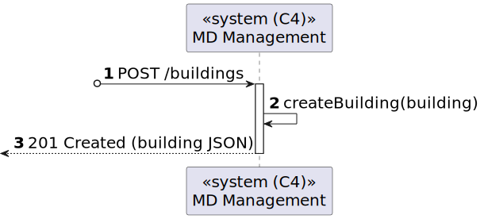

# US 01 [150] - As a Campus Manager, I want to create a building.

|              |                         |
| ------------ | ----------------------- |
| ID           | 1                       |
| Sprint       | A                       |
| Module       | 1.2 - Campus Management |
| UC           | ARQSI                   |
| Observations | POST                    |

## 1. Requirements

> ### "As a Campus Manager, I want to create a building."

## 1.1. Client Specifications

## [Question](https://moodle.isep.ipp.pt/mod/forum/discuss.php?d=25033)

> Relativamente à criação de edifícios é suposto criar-mos um edifício sem nenhum piso inicialmente e depois adicionarmos os pisos?
>
> Por exemplo: Criar o edifício A apenas, sem nenhum piso, e só depois na US 190 criar-mos os respetivos pisos do edifício A.
>
> Ou é necessário sempre que criarmos um edifício especificar os pisos que o mesmo tem?
>
> Por exemplo: Criar o edifício A, com os pisos A1, A2, A3 com as dimensões da grelha para cada um dos pisos.

### Answer

"são dois requisitos independentes. 150 apenas define o edificio. posteriormente o utilizador invocará o caso de uso correspondente ao requisito 190 para criar cada piso desse edificio"

## [Question](https://moodle.isep.ipp.pt/mod/forum/discuss.php?d=25047)

> O nome do edifício tem limitações como, por exemplo, tem de ter uma letra e números? E para além do nome do edifício, que mais informação deve ser guardada sobre o edifício.

### Answer

"ver (https://moodle.isep.ipp.pt/mod/forum/discuss.php?d=25016#p31679)

o código do edificio é obrigatório, no máximo 5 caracteres, letras e digitos, podendo conter espaços no meio
o nome do edificio é opcional, no máximo 50 caracteres alfanuméricos"
"a breve descrição é opcional, com o máximo de 255 caracteres"

## [Question](https://moodle.isep.ipp.pt/mod/forum/discuss.php?d=25051)

> A minha dúvida prende-se com o propósito do carregamento de um mapa de piso.
>
> Quando nos referimos a um mapa de um determinado piso de um edifício, qual é, precisamente, o objetivo desse carregamento? Adicionar informações novas a esse piso?
>
> Por exemplo, se considerarmos a situação em que temos um edifício A criado, ao carregar um mapa de piso é suposto criar o piso se ele não existir e adicionar as respetivas salas presentes nesse mapa?

### Answer

"o edificio e o piso já devem estar criados. a funcionalidade de carregamento do mapa é complementar a esses dois requisitos e permite fazer o upload da planta (mapa) do piso para a posterior visualização"

---

## 2. Analysis

### 2.1. Views

All the global views are available in the [views](../../views/readme.md) document.

The views presented here are the ones that are relevant to this user story.

#### Level 1

##### Processes

---

#### Level 2

##### Processes

---

#### Level 3

##### Processes

