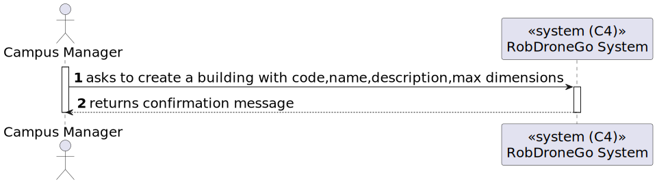
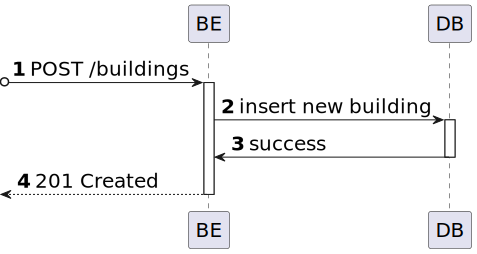

# US 01 [150] - As a Campus Manager, I want to create a building.

|              |                         |
| ------------ | ----------------------- |
| ID           | 1                       |
| Sprint       | A                       |
| Module       | 1.2 - Campus Management |
| UC           | ARQSI                   |
| Observations | POST                    |

## 1. Requirements

**"As a Campus Manager, I want to create a building."**

_Notes:_

## 1.1. Client Specifications

---

## 2. Analysis

### 2.1. Views

#### Level 1

##### Logical

##### Processes

---

#### Level 2

#### Logical

##### Processes

##### Implementation

##### Physical

---

#### Level 3

##### Logical

##### Processes

##### Implementation

##### Physical

