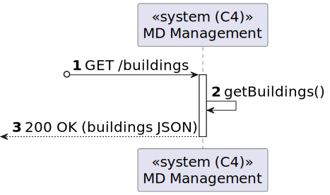
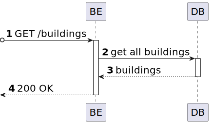

# US 03 [170]

|              |                         |
| ------------ | ----------------------- |
| ID           | 3                       |
| Sprint       | A                       |
| Module       | 1.2 - Campus Management |
| UC           | ARQSI                   |
| Observations | GET                     |

## 1. Requirements

> ### "As a Campus Manager, I want to list all buildings."

## 1.1. Client Specifications

N/A

---

## 2. Analysis

All the global views are available in the [views](../../views/readme.md) document.

The views presented here are the ones that are relevant to this user story.

#### Level 1

##### Processes

---

#### Level 2

##### Processes

---

#### Level 3

##### Processes

