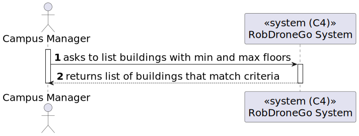

# US 04 [180] - As a Campus Manager, I want to list buildings with min & max floors.

|              |                         |
| ------------ | ----------------------- |
| ID           | 4                       |
| Sprint       | A                       |
| Module       | 1.2 - Campus Management |
| UC           | ARQSI                   |
| Observations | GET                     |

## 1. Requirements

> "As a Campus Manager, I want to list buildings with min & max floors."

## 1.1. Client Specifications

No client specifications were provided regarding this user story.

---

## 2. Analysis

### 2.1. Views

All the global views are available in the [views](../../views/readme.md) document.

The views presented here are the ones that are relevant to this user story.

#### Level 1

##### Processes

---

#### Level 2

##### Processes

---

#### Level 3

##### Processes

