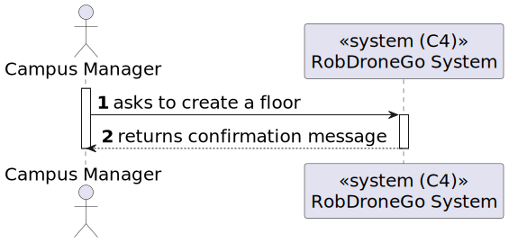
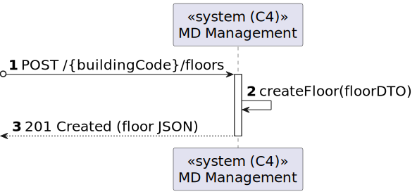
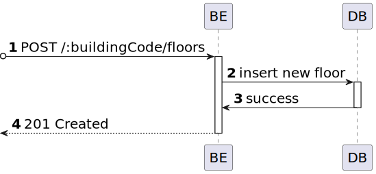

# US 05 [190]

|              |                         |
| ------------ | ----------------------- |
| ID           | 5                       |
| Sprint       | A                       |
| Module       | 1.2 - Campus Management |
| UC           | ARQSI                   |
| Observations | POST                    |

## 1. Requirements

> ### "As a Campus Manager, I want to create a floor."

## 1.1. Client Specifications

## [Question](https://moodle.isep.ipp.pt/mod/forum/discuss.php?d=25033)

> Relativamente à criação de edifícios é suposto criar-mos um edifício sem nenhum piso inicialmente e depois adicionarmos os pisos?
>
> Por exemplo: Criar o edifício A apenas, sem nenhum piso, e só depois na US 190 criar-mos os respetivos pisos do edifício A.
>
> Ou é necessário sempre que criarmos um edifício especificar os pisos que o mesmo tem?
>
> Por exemplo: Criar o edifício A, com os pisos A1, A2, A3 com as dimensões da grelha para cada um dos pisos.

### Answer

"são dois requisitos independentes. 150 apenas define o edificio. posteriormente o utilizador invocará o caso de uso correspondente ao requisito 190 para criar cada piso desse edificio"

## [Question](https://moodle.isep.ipp.pt/mod/forum/discuss.php?d=25016)

> Será possível esclarecer como funcionarão estas user stories? Com a 230 (Carregar mapa do piso) o nosso entendimento foi que as células seriam carregadas já com a criação de salas e pisos, e assim sendo não faria sentido as outras duas user stories, onde é pedido para criar um piso de um edifício e uma sala. Não entendemos o que é pretendido com as us's 190 e 310.

### Answer

"

- o requisito 150 Criar edificio permite criar um edificio, exemplo, edificio "B", com um nome opcional e com uma breve descrição (ex., "departamento de engenharia informática") indicando a dimensão máxima de cada piso em termos de células (ex., 10 x 10)

- o requisito 190 Criar piso permite definir um piso para um dos edificios criados anteriormente, por exemplo, o piso 1 do edificio B com uma breve descrição (ex., "salas TP")
- o requisito 230 Carregar mapa de piso permite ao utilizador fazer upload de um ficheiro descrevendo o mapa de um dado piso. esse ficheiro deve ser validado se tem a estrutura correta e se obedece ao tamanho máximo definido aquando da criação do edificio

- o requisito 310 Criar sala permite definir um sala num dado piso de um edificio, exemplo sala "B310" no 3º piso do edificio B, com uma categorização dessa sala (Gabinete, Anfiteatro, Laboratório, Outro) e uma breve descrição, ex., "Laboratório de Engenharia de Qualidade"

## 2. Analysis

### 2.1. Views

All the global views are available in the [views](../../views/readme.md) document.

The views presented here are the ones that are relevant to this user story.

#### Level 1

##### Processes

---

#### Level 2

##### Processes

---

#### Level 3

##### Processes

