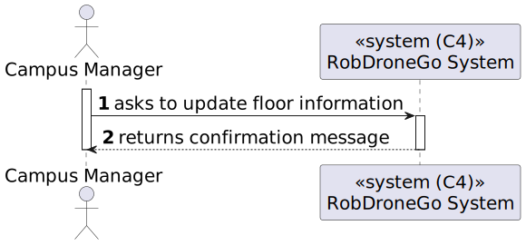
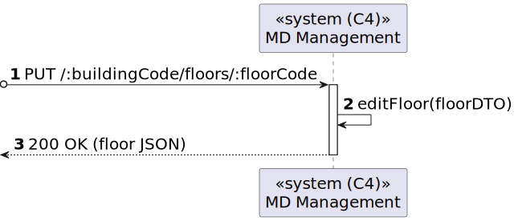
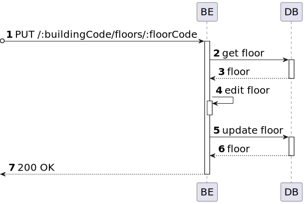

# US 06 [200]

|              |                         |
| ------------ | ----------------------- |
| ID           | 6                       |
| Sprint       | A                       |
| Module       | 1.2 - Campus Management |
| UC           | ARQSI                   |
| Observations | PUT/PATCH               |

## 1. Requirements

> "As a Campus Manager, I want to edit a floor's info."

## 1.1. Client Specifications

## [Question](https://moodle.isep.ipp.pt/mod/forum/discuss.php?d=25168)

> Em relação às User Stories de edição, temos já uma ideia das informações que são opcionais, mas queremos ter a certeza daquilo que é editável ou não.
> Posto isto, poderia indicar que informações pretende editar na US200?

### Answer

"editar piso - todas as informações à exceção do edificio a que o piso se refere"

---

## 2. Analysis

### 2.1. Views

All the global views are available in the [views](../../views/readme.md) document.

The views presented here are the ones that are relevant to this user story.

#### Level 1

##### Processes

---

#### Level 2

##### Processes

---

#### Level 3

##### Processes

