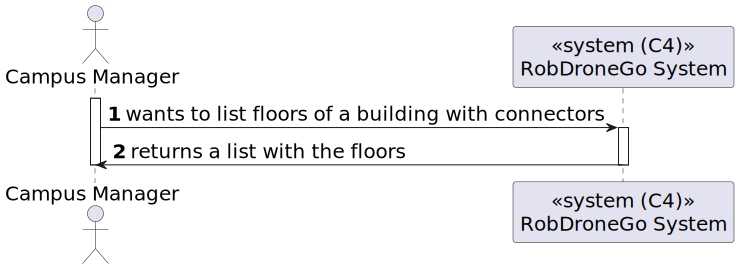
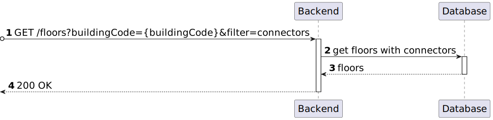

# US 08 [220]

|              |                         |
| ------------ | ----------------------- |
| ID           | 8                       |
| Sprint       | A                       |
| Module       | 1.2 - Campus Management |
| UC           | ARQSI                   |
| Observations | POST                    |

## 1. Requirements

**"As a Campus Manager, I want to list floors with passages to other buildings."**

## 1.1. Client Specifications

The robots will travel through the floors of the buildings.

## 1.2. Client Clarifications

> [**Question**: ...](https://moodle.isep.ipp.pt/mod/forum/discuss.php?d=...)
>
> **Answer**: "..."

## 2. Analysis

### 2.1. Views

All the global views are available in the [views](../../views/readme.md) document.

The views presented here are the ones that are relevant to this user story.

#### Level 1

##### Processes View

#### Level 2

##### Processes View

<!-- ##### Implementation View -->

<!-- ##### Physical View -->

#### Level 3

##### Processes View

<!-- ##### Implementation View -->

<!-- ##### Physical View -->

### 2.2. Tests

## 3. Demonstration

`GET /floors?buildingId={buildingId}&filter=passages`

