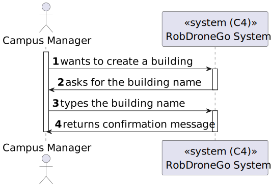

# US 08 [220]

|              |                         |
| ------------ | ----------------------- |
| ID           | 8                       |
| Sprint       | A                       |
| Module       | 1.2 - Campus Management |
| UC           | ARQSI                   |
| Observations | POST                    |

## 1. Requirements

**"As a Campus Manager, I want to list floors with connectors to other buildings."**

_Notes:_

## 1.1. Client Specifications

The robots will travel through the floors of the buildings.

## 1.2. Client Clarifications

> [**Question**: ...](https://moodle.isep.ipp.pt/mod/forum/discuss.php?d=...)
>
> **Answer**: "..."

## 2. Analysis

### 2.1. Views

#### Level 1

##### Logic View

##### Processes View

#### Level 2

##### Logic View

##### Processes View

##### Implementation View

##### Physical View

#### Level 3

##### Logic View

##### Processes View

##### Implementation View

##### Physical View

### 2.2. Tests

## 3. Demonstration

