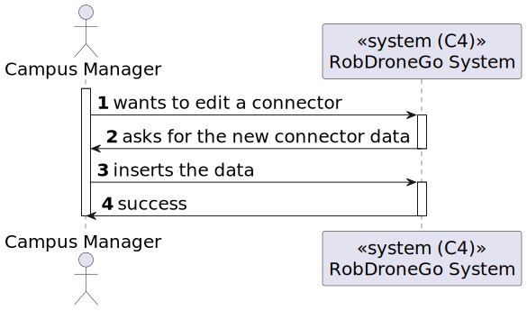
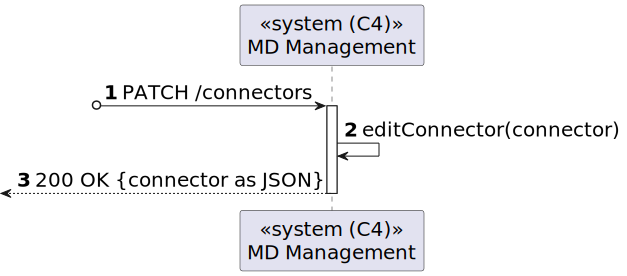
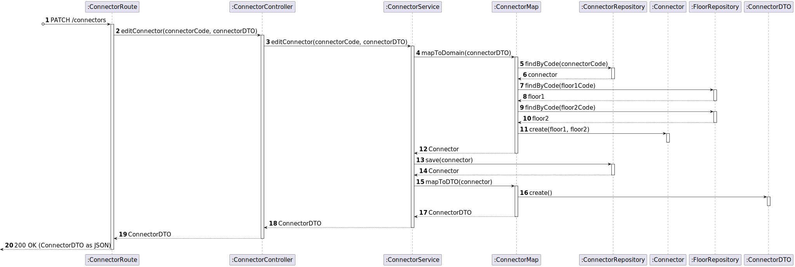

# US 11 [250]

|              |                         |
| ------------ | ----------------------- |
| ID           | 11                      |
| Sprint       | A                       |
| Module       | 1.2 - Campus Management |
| UC           | ARQSI                   |
| Observations | PUT/PATCH               |

## 1. Requirements

**"As a Campus Manager, I want to edit a connector between buildings."**

## 1.1. Client Clarifications

> [**Question**: Relativamente à US250 o que é que pretende que seja possivel editar numa passagem entre edificios?](https://moodle.isep.ipp.pt/mod/forum/discuss.php?d=25164)
>
> **Answer**: "(...) deve ser possível corrigir todos os dados da passagem."

---

> [**Question**: Em relação às User Stories de edição, temos já uma ideia das informações que são opcionais, mas queremos ter a certeza daquilo que é editável ou não. Posto isto, poderia indicar que informações pretende editar nas US160, US200, US250 e US280?](https://moodle.isep.ipp.pt/mod/forum/discuss.php?d=25168)
>
> **Answer**: "(...) Requisito 250 - editar passagem - todas as informações (...)"

## 2. Analysis

### 2.1. Views

All the global views are available in the [views](../../views/readme.md) document.

The views presented here are the ones that are relevant to this user story.

#### Level 1

##### Processes View

#### Level 2

##### Processes View

#### Level 3

##### Processes View

### 2.2. Tests

## 3. Demonstration

`POST /passages`

