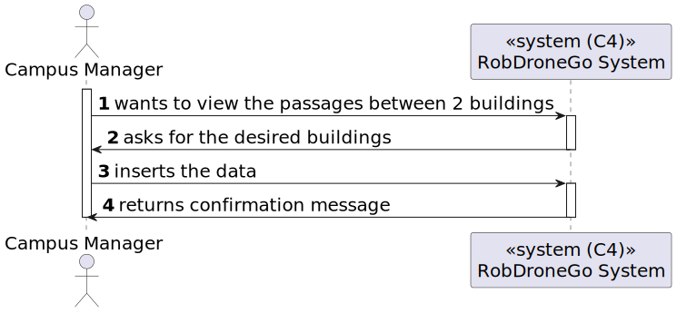
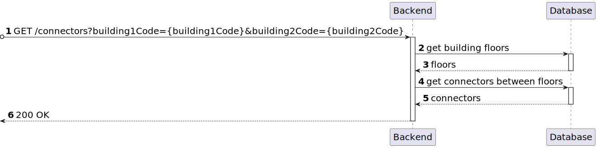

# US 12 [260]

|              |                         |
| ------------ | ----------------------- |
| ID           | 12                      |
| Sprint       | A                       |
| Module       | 1.2 - Campus Management |
| UC           | ARQSI                   |
| Observations | GET                     |

## 1. Requirements

> ### "As a Campus Manager, I want to list connectors between 2 buildings."

## 1.1. Client Clarifications

> [**Question**: (...) haverão múltiplas passagens entre 2 edifícios? (...) esta listagem necessita de uma questão ao utilizador para listar passagens entre todos os edifícios ou entre 2?](https://moodle.isep.ipp.pt/mod/forum/discuss.php?d=25007)
>
> **Answer**: "Sim, podem existir várias passagens entre edificios. Por exemplo, no edificio B do ISEP existe uma passagem no piso 2 para o edificio G, uma passagem no piso 3 para o edificio G e uma passagem no piso 3 para o edificio I.
>
> O objetivo deste requisito é permitir consultar quais as passagens existentes entre dois edifícios. Se nada for indicado devem ser devolvidas todas as passagens entre todos os edifícios. Se for indicado um par de edifícios devem apenas ser devolvidas as passagens entre esses dois edifícios.
>
> Notem que uma vez que as passagens são bidirecionais, uma passagem entre o edifício B e o I, significa que se pode atravessar de B para I ou de I para B. o par de edifícios utilizado para filtrar esta consulta não implica nenhum tipo de restrição no sentido da passagem."

## 2. Analysis

### 2.1. Views

All the global views are available in the [views](../../views/readme.md) document.

The views presented here are the ones that are relevant to this user story.

#### Level 1

##### Processes View

#### Level 2

##### Processes View

#### Level 3

##### Processes View

