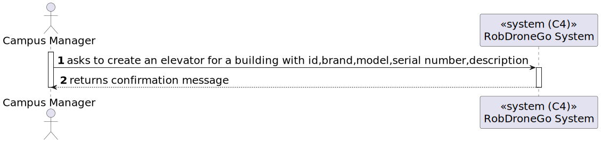

# US 13 [270]

|              |                         |
| ------------ | ----------------------- |
| ID           | 13                      |
| Sprint       | A                       |
| Module       | 1.2 - Campus Management |
| UC           | ARQSI                   |
| Observations | POST                    |

## 1. Requirements

**"As a Campus Manager, I want to create an elevator in a building."**

## 1.1. Client Specifications

## [Question 11](https://moodle.isep.ipp.pt/mod/forum/discuss.php?d=25046)

> Dentro do ficheiro RFP-LAPR5-2023-2024, este excerto está presente:
>
> Elevadores de cada piso e sua localização na grelha do mapa:
>
> • (a, a1, elevador(2, 8, oeste))
>
> • …
>
> Passagens entre piso e sua localização na grelha do mapa:
>
> • (a, j, a1, j2, passagem(5, 8, oeste))
>
> • (a, h, a1, h2, passagem(2, 0, oeste))
>
> • …
>
> São representados os elevadores e as passagens, respetivamente, e dentro de "elevador(...)" ou "passagem(...)" estão indicadas as coordenadas mais a Norte das duas células onde o elevador e as passagens estão presentes (pois estão encostadas lateralmente).
>
> O elevador e/ou a passagem têm 2 espaços na grelha sempre (no caso de ter o atributo oeste, assumir que há mais uma célula a baixo, e com o atributo norte, assumir que há mais uma célula à direita) ou teremos que mencionar a existência de uma segunda célula numa nova descrição (como, no caso dos elevadores, (a, a1, elevador(2, 8, oeste)) e (a, a1, elevador(3, 8, oeste)))?

### Answer

"como indicado no RFP, essa informação é uma representação conceptual sobre o tipo de informação que será necessário lidar no âmbito do sistema. podem livremente decidir como implementar tecnicamente essa representação. de um ponto de vista de requisitos o importante é que o utilizador possa definir a localização da passagem ou do elevador pelo que ambas as opções são viaveis. No futuro existirá um editor visual de mapas que esconderá do utilizador toda essa manipulação de informação. de momento podem optar por assumir que as passagens e os elevadores ocupam sempre duas células e que apenas é necessário indicar a célula de "topo" dessas duas"

## [Question 16.1](https://moodle.isep.ipp.pt/mod/forum/discuss.php?d=25070)

> Podemos dizer então que o carregamento do mapa, apenas adiciona o seguinte: as dimensões das salas, onde ficam as paredes do piso, onde ficam os elevadores e onde ficam as passagens.
> Apenas temos de indicar qual é que é o id do objeto (sala, passagem, elevador ou parede) e qual é a sua dimensão ou posição.
> Caso o utilizador coloque a referência para um objeto que ainda não exista (por exemplo um elevador que ainda não foi criado) o ficheiro deve ser considerado inválido?

### Answer

"Em SGRAI será disponibilizado o exemplo: https://www.dei.isep.ipp.pt/~jpp/LAPR5/Thumb_Raiser_LAPR5.html

O ficheiro JSON correspondente ao mapa encontra-se em https://www.dei.isep.ipp.pt/~jpp/LAPR5/mazes/LAPR5.json

Notem que se trata de um exemplo que podme usar como base e que terá que ser adapatdo à realidade dos requisitos apresentados no RFP e de acordo com as vossas decisões de design"

## [Question 26](https://moodle.isep.ipp.pt/mod/forum/discuss.php?d=25267)

> há alguma restrição para o ID do elevador?

### Answer

"não sei a que se refere quando refere "ID"
assumindo que a sua pergunta é sobre se há necessidade de identificar os elevadores, cada elevador terá um número identificativo único no edificio. De momento assume-se que existe apenas um elevador em cada edificio."

## [Question 28](https://moodle.isep.ipp.pt/mod/forum/discuss.php?d=25298)

> Gostaria de saber que atributos deveria ter o elevador, para além de uma lista de pisos aos quais consegue aceder dentro do seu edifício. Algumas das ideias que me surgiram foram o piso em que estava localizado naquele momento, número de série, fabricante ou descrição.

### Answer

- edificio (obrigatório)
- número identificativo (obrigatório, único no edificio)
- lista de pisos do edificio servidos pelo elevador (obrigatório)
- marca (opcional, alfanumerico, 50 caracteres)
- modelo (opcional, mas obrigatório se marca for introduzido, alfanumerico, 50 caracteres)
- número de série do fabricante (opcional, alfanumerico, 50 caracteres)
- breve descrição (opcional, alfanumerico, 250 caracteres)

---

## 2. Analysis

### 2.1. Views

All the global views are available in the [views](../../views/readme.md) document.

The views presented here are the ones that are relevant to this user story.

#### Level 1

##### Processes

---

#### Level 2

##### Processes

---

#### Level 3

##### Processes

