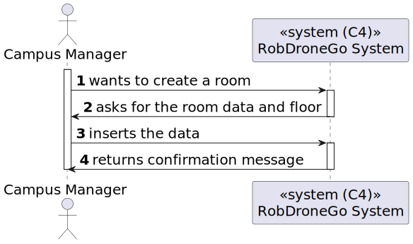

# US 17 [310]

|              |                         |
| ------------ | ----------------------- |
| ID           | 17                      |
| Sprint       | A                       |
| Module       | 1.2 - Campus Management |
| UC           | ARQSI                   |
| Observations | POST                    |

## 1. Requirements

**"As a Campus Manager, I want to create a room in a floor."**

## 1.1. Client Specifications

## Question

> Será possível esclarecer como funcionarão estas user stories? Com a 230 (Carregar mapa do piso) o nosso entendimento foi que as células seriam carregadas já com a criação de salas e pisos, e assim sendo não faria sentido as outras duas user stories, onde é pedido para criar um piso de um edifício e uma sala. Não entendemos o que é pretendido com as us's 190 e 310.

### Answer

- o requisito 310 Criar sala permite definir um sala num dado piso de um edificio, exemplo sala "B310" no 3º piso do edificio B, com uma categorização dessa sala (Gabinete, Anfiteatro, Laboratório, Outro) e uma breve descrição, ex., "Laboratório de Engenharia de Qualidade"

## 2. Analysis

### 2.1. Views

All the global views are available in the [views](../../views/readme.md) document.

The views presented here are the ones that are relevant to this user story.

#### Level 1

##### Processes View

#### Level 2

##### Processes View

#### Level 3

##### Processes View

