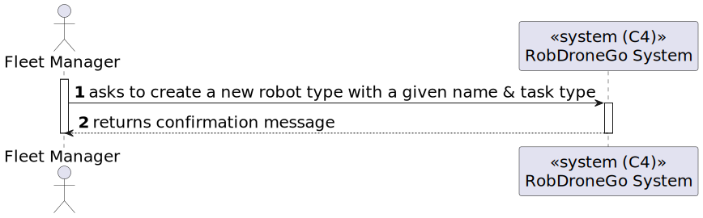
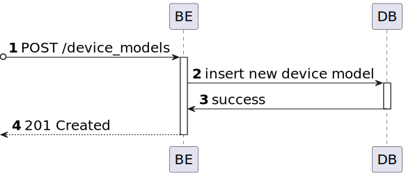

# US 18 [350]

|              |                        |
| ------------ | ---------------------- |
| ID           | 18                     |
| Sprint       | A                      |
| Module       | 1.3 - Fleet Management |
| UC           | ARQSI                  |
| Observations | POST                   |

## 1. Requirements

> ### "As a Fleet Manager, I want to add a new robot type with a name and assign specific tasks from a predefined list of tasks."

## 1.1 Client Clarifications

## [Question 1](https://moodle.isep.ipp.pt/mod/forum/discuss.php?d=24951)

> Quanto às tarefas que o robot realiza, eu e o meu grupo ficámos com incertezas relativamente a alguns tópicos.Realmente, um robot pode ser do tipo robisep ou droneisep e, sabemos que cada um destes tipos de robot, tem possíveis tarefas associadas. No entanto, supondo que, por exemplo, as tarefas de vigilância, limpeza e entrega de objetos estavam associadas ao tipo robisep, era possível existir um robot desse mesmo tipo que realizasse todas essas tarefas e, em simultâneo, existir outro robot também desse tipo mas, com permissões de apenas fazer limpeza e vigilância ou, até mesmo, só poder fazer limpeza?

### Answer

"Roboisep são robots. droneisep são drones.

neste momento vamos apenas focar o âmbito nos robots e deixar os drones para fases posteriores.

de momento apenas existem dois tipos de tarefas conhecidas que o sistema deve suportar: vigilância e entrega de objectos. quando criam um tipo de robot deve ser possivel identificar qual ou quais destas tarefas esse tipo de robot pode executar."

## [Question 10](https://moodle.isep.ipp.pt/mod/forum/discuss.php?d=25050)

> relativamente aos robots, qual o elemento que identifica um robot?
>
> Podemos atribuir um ID ao mesmo? Se sim, alguma especificação para o mesmo?
>
> Difere caso seja robIsep ou droneisep?

### Answer

"cada Robot possui um número de série do fabricante e que deve ser registado quando se cria o robot no sistema. cada robot é identificado por um código e um nickname atribuidos pelo administrador. Por exemplo, um robot da marca X com número de série 1234567 tem o código "picker-0001" e o nickname "Robert" enquanto um outro robot da marca Y com número de série 456789 tem o código "sec-A-001" e o nickname "Jason""

> O número de série será único para cada robot ou será comum para o mesmo tipo de robots?

"o número de série é único para cada robot da mesma marca"

## [Question 22](https://moodle.isep.ipp.pt/mod/forum/discuss.php?d=25171)

> Relativamente à US350 foi referido numa resposta anterior "o requisito 350 permite definir que tipos de robots existem. por exemplo "Tipo A: Robot marca X modelo Y com capacidade de executar tarefas de vigilância"
>
> Pretende alguma regra de negócio para o limite de caracteres para o tipo, marca e modelo?

### Answer

"tipo de robot: obrigatório, alfanumericos, maximo 25 caracteres
marca: obrigatório, maximo 50 caracteres
modelo: obrigatório, máximo 100 caracteres"

---

## 2. Analysis

### 2.1. Views

All the global views are available in the [views](../../views/readme.md) document.

The views presented here are the ones that are relevant to this user story.

#### Level 1

##### Processes

---

#### Level 2

##### Processes

---

#### Level 3

##### Processes

