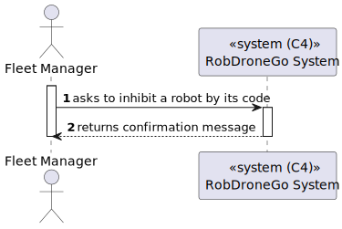
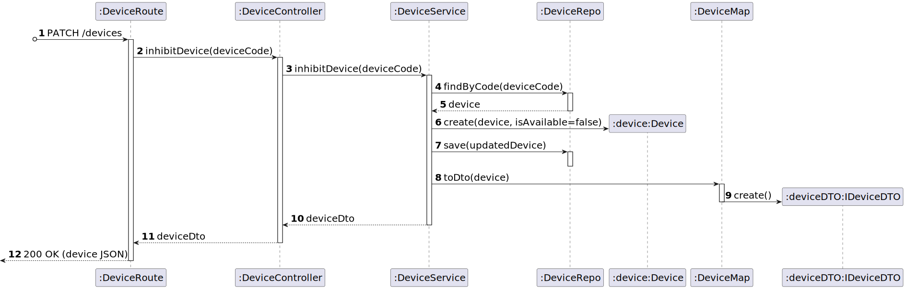

# US 20 [370]

|              |                        |
| ------------ | ---------------------- |
| ID           | 20                     |
| Sprint       | A                      |
| Module       | 1.3 - Fleet Management |
| UC           | ARQSI                  |
| Observations | PATCH                  |

## 1. Requirements

> "As a Fleet Manager, I want to disable a robot."

## 1.1. Client Clarifications

## [Question](https://moodle.isep.ipp.pt/mod/forum/discuss.php?d=25265)

> Ao criar um novo robo, qual o estado dele por defeito, isto é, ativo ou inativo?

### Answer

"ao criar um robot ele fica no estado ativo"

---

## 2. Analysis

### 2.1. Views

All the global views are available in the [views](../../views/readme.md) document.

The views presented here are the ones that are relevant to this user story.

#### Level 1

##### Processes

---

#### Level 2

##### Processes

---

#### Level 3

##### Processes

