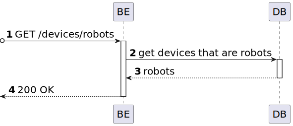

# US 21 [380]

|              |                        |
| ------------ | ---------------------- |
| ID           | 21                     |
| Sprint       | A                      |
| Module       | 1.3 - Fleet Management |
| UC           | ARQSI                  |
| Observations | GET                    |

## 1. Requirements

> ### "As a Fleet Manager, I want to list all robots."

## 1.1 Client Clarifications

## [Question 10](https://moodle.isep.ipp.pt/mod/forum/discuss.php?d=25050)

> relativamente aos robots, qual o elemento que identifica um robot?
>
> Podemos atribuir um ID ao mesmo? Se sim, alguma especificação para o mesmo?
>
> Difere caso seja robIsep ou droneisep?

### Answer

"cada Robot possui um número de série do fabricante e que deve ser registado quando se cria o robot no sistema. cada robot é identificado por um código e um nickname atribuidos pelo administrador. Por exemplo, um robot da marca X com número de série 1234567 tem o código "picker-0001" e o nickname "Robert" enquanto um outro robot da marca Y com número de série 456789 tem o código "sec-A-001" e o nickname "Jason""

## 2. Analysis

### 2.1. Views

All the global views are available in the [views](../../views/readme.md) document.

The views presented here are the ones that are relevant to this user story.

#### Level 1

##### Processes

---

#### Level 2

##### Processes

---

#### Level 3

##### Processes

../us18-350/views/level-2 ../us18-350/views/level-3
