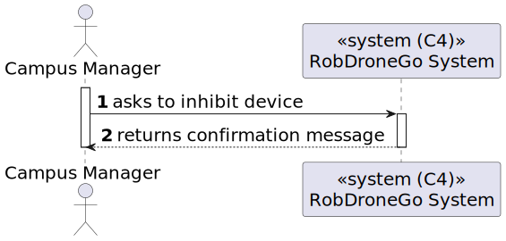
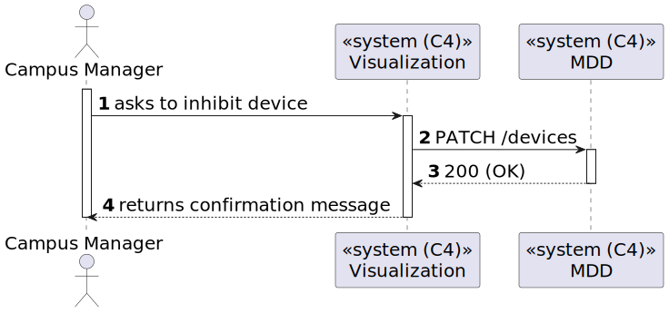
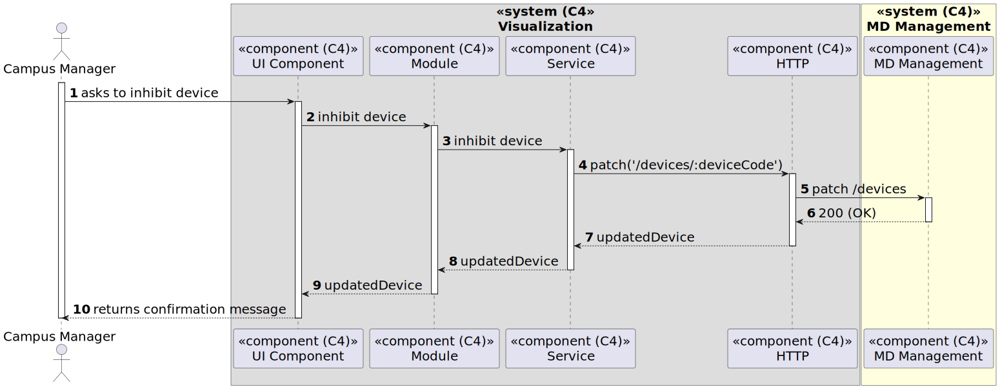

# US 25 [1020] - US1120 - US1020 - As a Fleet Manager, I want to inhibit a Robot

|              |                         |
| ------------ | ----------------------- |
| ID           | 25                      |
| Sprint       | B                       |
| Module       | 1.2 - Campus Management |
| UC           | ARQSI                   |
| Observations | PATCH                   |

## 1. Requirements

> ### "US1020 - As a Fleet Manager, I want to inhibit a Robot."

## 1.1. Client Specifications

## [Question](https://moodle.isep.ipp.pt/mod/forum/discuss.php?d=25118)

> há a possibilidade de inibir um robo. No entanto, para além deste "estado" que outros estados pretende que existam? em funcionamento, ocupado, livre, a executar tarefa? Ou basta apenas inibido - desinibido?

### Answer

"funcionalmente não existe esse conceito de "estado" que referes. poderá ser no entanto algo util em termos técnicos. De um ponto de vista funcional pretende-se que seja possivel inibir ou desinibr um robot e que essa informação seja devidamente utilizada nos restantes casos de uso. por exemplo, um robot inibido não pode executar tarefas."

## 2. Analysis

### 2.1. Views

All the global views are available in the [views](../../views/readme.md) document.

The views presented here are the ones that are relevant to this user story.

#### Level 1

##### Processes

---

#### Level 2

##### Processes

---

#### Level 3

##### Processes

