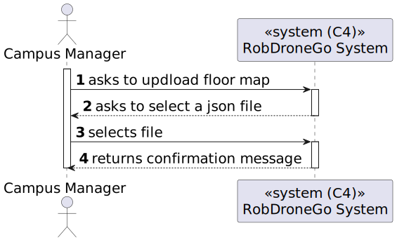
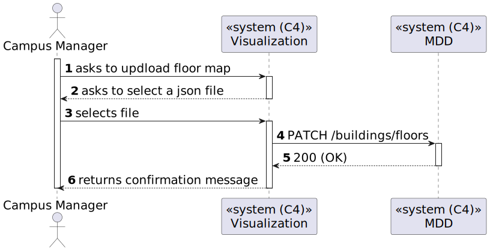
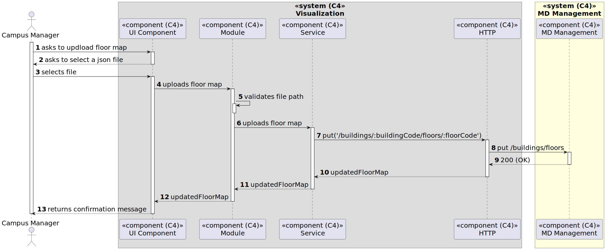

# US 25 [1070] - US1120 - As a Campus Manager, I want to upload a Map to a floor

|              |                         |
| ------------ | ----------------------- |
| ID           | 25                      |
| Sprint       | B                       |
| Module       | 1.2 - Campus Management |
| UC           | ARQSI                   |
| Observations | PATCH                   |

## 1. Requirements

> ### "US1120 - As a Campus Manager, I want to upload a Map to a floor."

## 1.1. Client Specifications

## [Question](https://moodle.isep.ipp.pt/mod/forum/discuss.php?d=25016)

> Será possível esclarecer como funcionarão estas user stories? Com a 230 (Carregar mapa do piso) o nosso entendimento foi que as células seriam carregadas já com a criação de salas e pisos, e assim sendo não faria sentido as outras duas user stories, onde é pedido para criar um piso de um edifício e uma sala. Não entendemos o que é pretendido com as us's 190 e 310.

### Answer

"o requisito 230 Carregar mapa de piso permite ao utilizador fazer upload de um ficheiro descrevendo o mapa de um dado piso. esse ficheiro deve ser validado se tem a estrutura correta e se obedece ao tamanho máximo definido aquando da criação do edificio"

## [Question](https://moodle.isep.ipp.pt/mod/forum/discuss.php?d=25052)

> Gostaria de saber se quando uma sala e criada o mapa do piso deve ser alterado para adicionar está sala e por sua vez quando é carregado um mapa no sistema se as salas do piso devem ser alteradas (por exemplo se o mapa carregado tiver apenas 3 salas e o piso anteriormente tinha 4)

### Answer

"no futuro existirá um editor de pisos que garantirá toda a consistência de informação. de momento não necessitam fazer tratamento adicional e podem assumir que o utilizador (ou o futuro editor) introduz essa informação de forma coerente"

## [Question](https://moodle.isep.ipp.pt/mod/forum/discuss.php?d=25070)

> Segundo o que já foi respondido no forum para carregar o mapa é necessário que já exista o edifício e o piso. Será necessário também ter os elevadores, as salas e as passagens já criadas?.
> Assim dessa forma existiria um ficheiro só com as dimensões para a grelha.
>
> Algo do genero:
>
> {
> "floorId":"1",
> "walls":[
>
>      {
>         "positionX":0,
>         "positionY":0,
>         "direction":"Oeste"
>      },
>      {
>         "positionX":0,
>         "positionY":1,
>         "direction":"Oeste"
>     }
>
> ], (...) }

### Answer

"sim, é necessário que essa informação já esteja presente no sistema. quanto ao formato do mapa, será fornecido um projeto exemplo em SGRAI para desenho de labirintos que podem utilizar como base para o módulo de visualização. poderão adaptar o código e o formato de mapa de acordo com o que acharem mais adequado aos requisitos e às vossas decisões de design."

---

## 2. Analysis

### 2.1. Views

All the global views are available in the [views](../../views/readme.md) document.

The views presented here are the ones that are relevant to this user story.

#### Level 1

##### Processes

---

#### Level 2

##### Processes

---

#### Level 3

##### Processes

