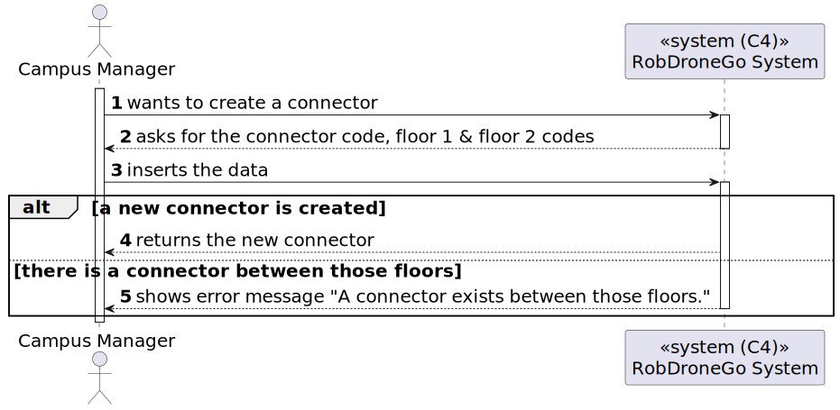
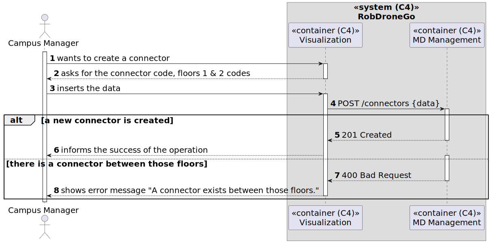
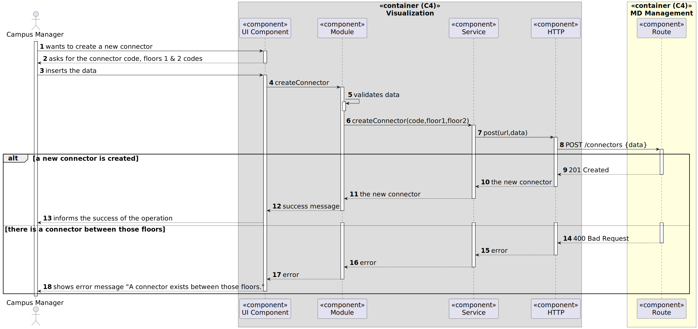

# US 33 [1170] - As a Campus Manager, I want to create a connector

|              |                         |
| ------------ | ----------------------- |
| ID           | 33                      |
| Sprint       | B                       |
| Module       | 1.2 - Campus Management |
| UC           | ARQSI                   |
| Observations | POST                    |

## 1. Requirements

> ### "As a Campus Manager, I want to create a connector."

## 1.1. Client Specifications

(...)

---

## 2. Analysis

### 2.1. Views

All the global views are available in the [views](../../views/readme.md) document.

The views presented here are the ones that are relevant to this user story.

#### Level 1

##### Processes

---

#### Level 2

##### Processes

---

#### Level 3

##### Processes

