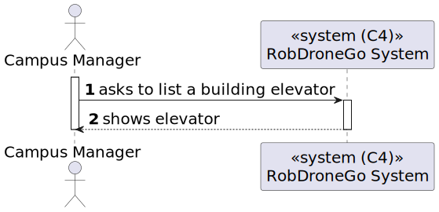
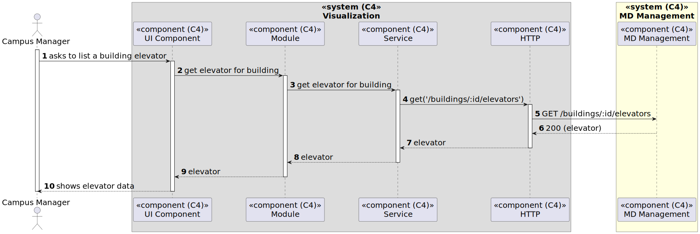

# US 37 [1140] - As a Campus Manager, I want to list the elevators in a building

|              |                         |
| ------------ | ----------------------- |
| ID           | 37                      |
| Sprint       | A                       |
| Module       | 1.2 - Campus Management |
| UC           | ARQSI                   |
| Observations | GET                     |

## 1. Requirements

> ### "As a Campus Manager, I want to list a building's elevator."

## 1.1. Client Specifications

## [Question 26](https://moodle.isep.ipp.pt/mod/forum/discuss.php?d=25267)

> há alguma restrição para o ID do elevador?

### Answer

"não sei a que se refere quando refere "ID"
assumindo que a sua pergunta é sobre se há necessidade de identificar os elevadores, cada elevador terá um número identificativo único no edificio. De momento assume-se que existe apenas um elevador em cada edificio."

## [Question 28](https://moodle.isep.ipp.pt/mod/forum/discuss.php?d=25298)

> Gostaria de saber que atributos deveria ter o elevador, para além de uma lista de pisos aos quais consegue aceder dentro do seu edifício. Algumas das ideias que me surgiram foram o piso em que estava localizado naquele momento, número de série, fabricante ou descrição.

### Answer

- edificio (obrigatório)
- número identificativo (obrigatório, único no edificio)
- lista de pisos do edificio servidos pelo elevador (obrigatório)
- marca (opcional, alfanumerico, 50 caracteres)
- modelo (opcional, mas obrigatório se marca for introduzido, alfanumerico, 50 caracteres)
- número de série do fabricante (opcional, alfanumerico, 50 caracteres)
- breve descrição (opcional, alfanumerico, 250 caracteres)

---

## 2. Analysis

### 2.1. Views

All the global views are available in the [views](../../views/readme.md) document.

The views presented here are the ones that are relevant to this user story.

#### Level 1

##### Processes

---

#### Level 2

##### Processes

---

#### Level 3

##### Processes

