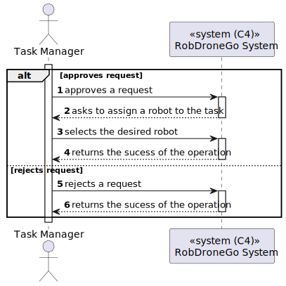

# US [470] - As Task Manager, I want to approve or reject a request

|              |                        |
| ------------ | ---------------------- |
| ID           | 470                    |
| Sprint       | C                      |
| Module       | 1.4 - Tasks Management |
| UC           | ARQSI                  |
| Observations | GET                    |

## 1. Requirements

> ### "US480 - As Task Manager, I want to approve or reject a request."

## 1.1. Client Specifications

## [Question](https://moodle.isep.ipp.pt/mod/forum/discuss.php?d=)

> ...?

### Answer

"..."

## 2. Analysis

### 2.1. Views

All the global views are available in the [views](../../views/readme.md) document.

The views presented here are the ones that are relevant to this user story.

#### Level 1

##### Processes

---

#### Level 2

##### Processes

---

#### Level 3

##### Processes

