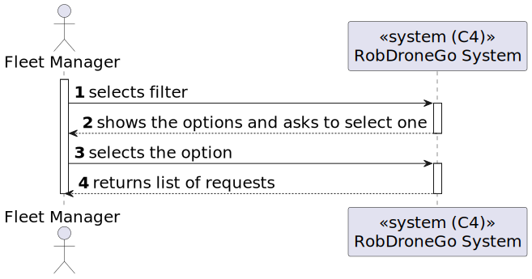
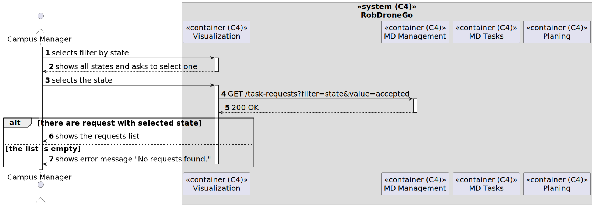
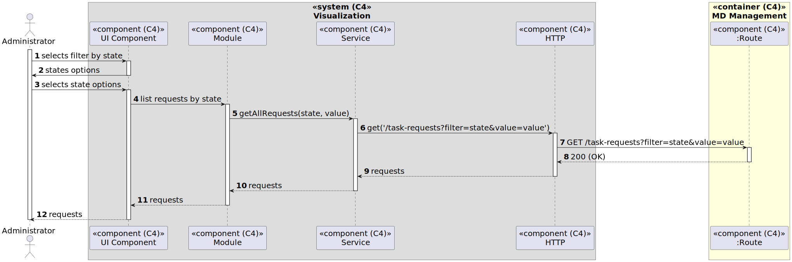
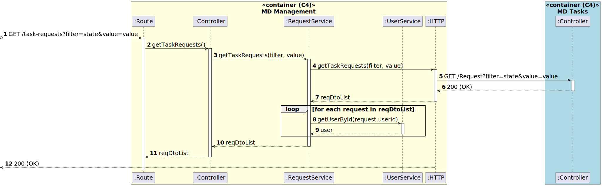
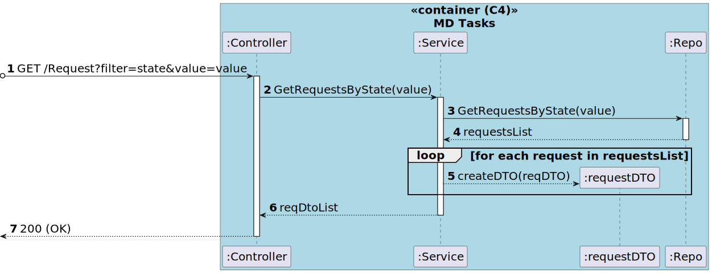

# US [490] - As Task Manager, I want to consult the requested tasks filtered by state, device or user.

|              |                        |
| ------------ | ---------------------- |
| ID           | 480                    |
| Sprint       | C                      |
| Module       | 1.4 - Tasks Management |
| UC           | ARQSI                  |
| Observations | GET                    |

## 1. Requirements

> ### "US480 - As Task Manager, I want to consult the requested tasks filtered by state, device or user."

## 1.1. Client Specifications

## [Question](https://moodle.isep.ipp.pt/mod/forum/discuss.php?d=26296)

### US490

> Em relação a esta US, nós estamos com umas dúvidas em relação ao que o cliente considera um tipo de dispositivo, por exemplo, seria robots e drones ou tipos especificos de robots?

### Answer

"considerar "tipo de robot""

## 2. Analysis

### 2.1. Views

All the global views are available in the [views](../../views/readme.md) document.

The views presented here are the ones that are relevant to this user story.

#### Level 1

##### Processes

---

#### Level 2

##### Processes

---

#### Level 3

##### Processes

###### Visualization

###### MD-Management

###### MD-Tasks

