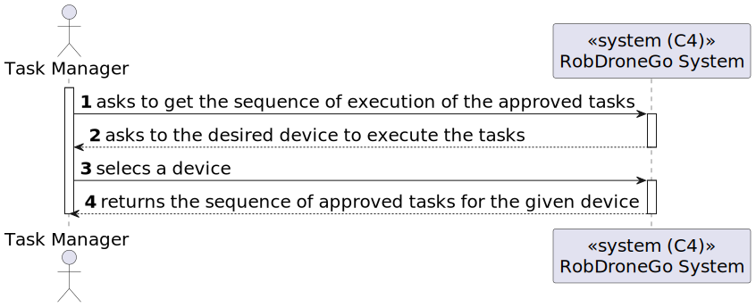
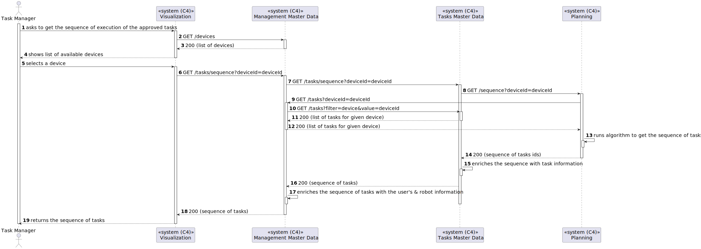

# US [480] - As Task Manager, I want to get the sequence of execution of the approved tasks

|              |                        |
| ------------ | ---------------------- |
| ID           | 500                    |
| Sprint       | C                      |
| Module       | 1.4 - Tasks Management |
| UC           | ARQSI                  |
| Observations | GET                    |

## 1. Requirements

> ### "US480 - As Task Manager, I want to get the sequence of execution of the approved tasks

## 1.1. Client Specifications

### [Question](https://moodle.isep.ipp.pt/mod/forum/discuss.php?d=25892)

#### US500/1410/1430 - task execution planning

> Based on what data/criteria (of a request) should the execution sequence of approved tasks be made? What is the priority to place some task ahead of another one? Should it be more sophisticated than executing approved (and assigned to a robot) requests in requesting order (first come first served)?

#### Answer

"according to what is stated in requirement 1410: "seja gerado um plano de atendimento das tarefas indicadas que indique uma sequência de execução das tarefas que seja criada através da geração de todas as sequências e escolha da que durar menos tempo.", that is, the sequence that takes the least amount of time to execute.

You can consider average times to calculate the duration of a request execution, for instance:

    move from one cell to another cell
    traverse a passage from one building to another
    use the elevator from one floor to an adjacent one
    pickup an object
    deliver an object

for simplicity you might assume a standard time for:

    pickup and delivery in the same building/floor
    pickup and delivery in the same building, different floor
    pickup and delivery in different buildings
    surveillance of a floor

all assumptions and simplifications must be properly identified, justified and explained.

There are currently no priority request. all request of the same type should be considered with equal priority
"

## [Question](https://moodle.isep.ipp.pt/mod/forum/discuss.php?d=26394)

### US609

> Gostaria de saber como é que o percurso automatico se procede. É o utilizador que chega ao módulo de visualização 3D e escolhe um ponto inicial e depois um final e o robot percorre esse percurso, ou é através de uma tarefa que já foi aceite e o utilizador quer ver o percurso dessa tarefa?

### Answer

"a partir da US 500 "consultar plano de execução" o utilizador poderá ver a sequencia de tarefas a executar, por exemplo numa tabela. em cada linha dessa tabela deve existir uma ação que permita saltar para o módulo de visualização 3D e ver a animação do percurso relativo à tarefa selecionada."

## 2. Analysis

### 2.1. Views

All the global views are available in the [views](../../views/readme.md) document.

The views presented here are the ones that are relevant to this user story.

#### Level 1

##### Processes

---

#### Level 2

##### Processes

---

#### Level 3

##### Processes

