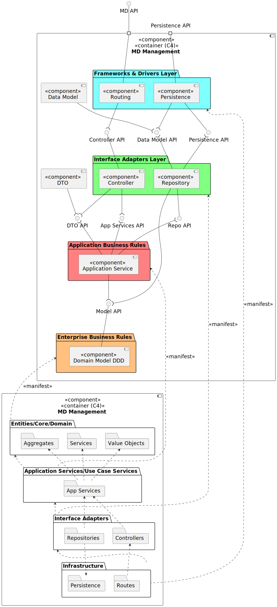

# Mapping between Views

This document contains the mapping between the views of the C4 model.

For the global overview of the system, refer to the [views](../readme.md) document.

## Level 2

### Logical View - Implementation View

### Implementation View - Physical View

## Level 3

### Logical View - Implementation View

### Implementation View - Physical View

