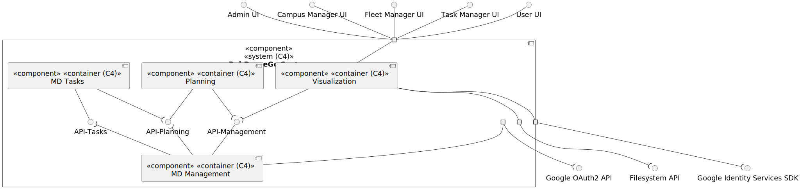
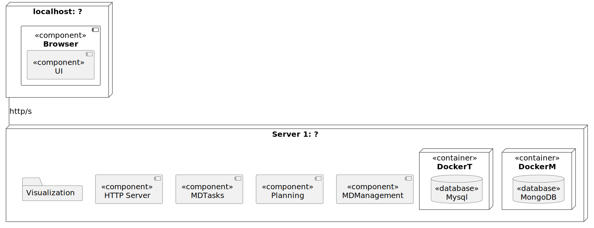
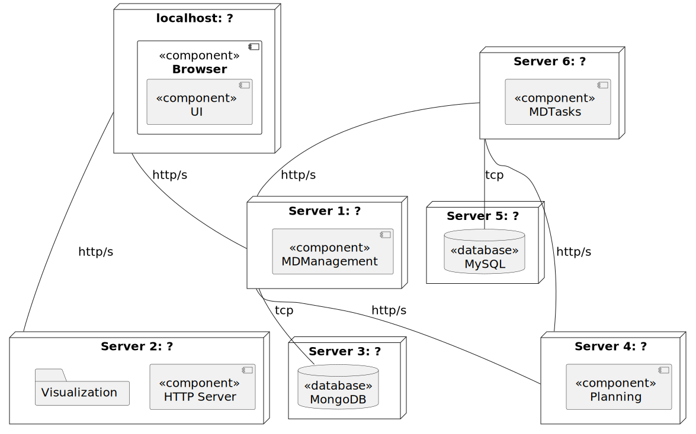
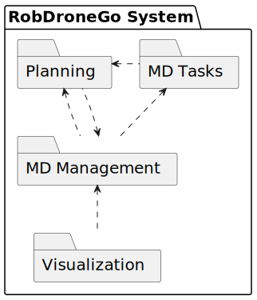
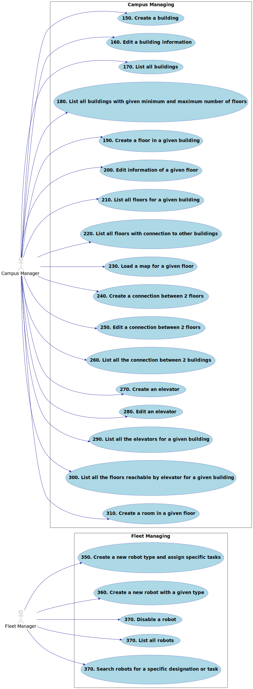

# Views

This document details all the global architectural views of the system.

This views can be used as a foundation to understand the system from a global perspective.

For the interaction between the components, refer to the [mapping](./mapping/readme.md) document.

## Level 1

### Logical View

## Level 2

### Logical View

### Physical View

For now, there are no specific constraints on the physical view. Bare in mind that this is just one possible implementation. This representation will likely change in the future.

#### Development Environment

In this environment, all the services are running on the same machine. This is the default environment for development.

The database is running on a docker container. The `docker-compose.yml` file is located in the root of the project.

#### Production Environment

In this environment, the services are running on different machines, this way we can scale the services independently.

Note that, as mentioned earlier, this is just one possible implementation and there are no specific constraints on the physical view for now.

### Implementation View

## Level 3

### MD Management

#### Logical View

#### Implementation View

### Visualization

#### Logical View

#### Implementation View

## Use Case Diagram

### Sprint A

### Sprint B

