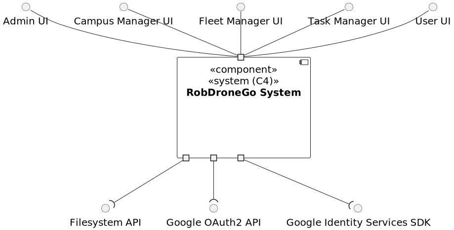
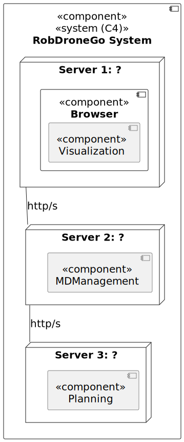

# Views

This document details all the global architectural views of the system.

This views can be used as a foundation to understand the system from a global perspective.

## Level 1

### Logical View

## Level 2

### Logical View

### Physical View

## Level 3

### Logical View

### Implementation View

